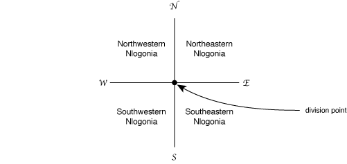

#Division of Nlogonia #11498

###The Problem

After centuries of hostilities and skirmishes between the four nations living in the land generally known as Nlogonia, and years of negotiations involving diplomats, politicians and the armed forces of all interested parties, with mediation by UN, NATO, G7 and SBC, it was at last agreed by all the way to end the dispute, dividing the land into four independent territories.

It was agreed that one point, called <i>division point</i>, with coordinates established in the negotiations, would define the country division, in the following way. Two lines, both containing the division point, one in the North-South direction and one in the East-West direction, would be drawn on the map, dividing the land into four new countries. Starting from the Western-most, Northern-most quadrant, in clockwise direction, the new
countries will be called Northwestern Nlogonia, Northeastern Nlogonia,
Southeastern Nlogonia and Southwestern Nlogonia.

The UN determined that a page in the Internet should exist so that
the inhabitants could check in which of the countries their homes are. You
have been hired to help implementing the system.

###The Input

The input contains several test cases. The first line of a test case
contains one integer <i>K</i> indicating the number of queries that
will be made (<i>0 &lt; K &#8804; 103</i>). The second line of a
test case contains two integers
<i>N</i> and <i>M</i> representing the coordinates of the division
point (<i>-104 &lt; N, M &lt; 104</i>). Each of
the <i>K</i> following lines contains two integers <i>X</i>
and <i>Y</i> representing the coordinates of a residence
(<i>-104 &#8804; X, Y &#8804; 104</i>).

The end of input is indicated by a line containing only the number zero.

###The Output

For each test case in the input your program must print one line containing:

- the word divisa (means border in Portuguese) if the residence is on one of the border lines (North-South or East-West);
- NO (means NW in Portuguese) if the residence is in Northwestern Nlogonia;
- NE if the residence is in Northeastern Nlogonia;
- SE if the residence is in Southeastern Nlogonia;
- SO (means SW in Portuguese) if the residence is in Southwestern Nlogonia.

#Example
	Sample Input	Sample Output
	------------------------------
	3
	2 1
	10 10			NE
	-10 1			divisa
	0 33			NO
	4
	-1000 -1000
	-1000 -1000		divisa
	0 0				NE
	-2000 -10000	SO
	-999 -1001		SE
	0
