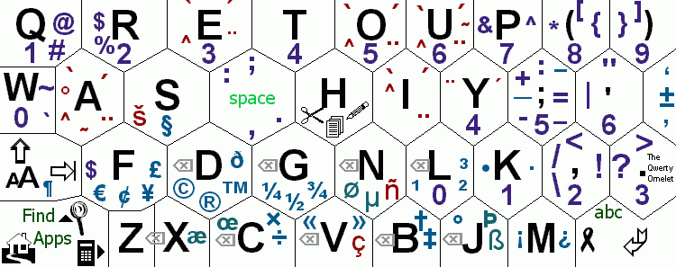

#Problem A: Letter Frequency

In this problem we are interested in the frequency of letters in a given line of text. Specifically, we want to know the most frequently occurring letter(s) in the text, ignoring case (to be clear, "letters" refers precisely to the 26 letters of the alphabet).

Input begins with the number of test cases on its own line. Each test case consists of a single line of text. The line may contain non-letter characters, but is guaranteed to contain at least one letter and less than 200 characters in total.

For each test case, output a line containing the most frequently occurring letter(s) from the text in lowercase (if there are ties, output all such letters in alphabetical order).

##Sample input

	1
	Computers account for only 5% of the country's commercial electricity consumption.

##Sample output

	co
---
*Sumudu Fernando*