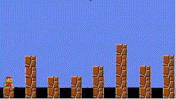

D: Jumping Mario
================
- **Input:** Standard Input
- **Output:** Standard Output


 
Mario is in the final castle. He now needs to jump over few walls and then enter the Koopa’s Chamber where he has to defeat the monster in order to save the princess. For this problem, we are only concerned with the “jumping over the wall” part. You will be given the heights of **N** walls from left to right. Mario is currently standing on the first wall. He has to jump to the adjacent walls one after another until he reaches the last one. That means, he will make (**N-1**) jumps. A high jump is one where Mario has to jump to a taller wall, and similarly, a low jump is one where Mario has to jump to a shorter wall. Can you find out the total number of high jumps and low jumps Mario has to make?
 
Input
-----
The first line of input is an integer **T** (**T < 30**) that indicates the number of test cases. Each case starts with an integer **N** (**0 < N < 50**) that determines the number of walls. The next line gives the height of the **N** walls from left to right. Each height is a positive integer not exceeding 10.
 
Output
------
For each case, output the case number followed by 2 integers, total high jumps and total low jumps, respectively. Look at the sample for exact format.
 
Sample Input
-------------
```
3
8
1 4 2 2 3 5 3 4
1
9
5
1 2 3 4 5
```
 
Sample Output
-------------
```
Case 1: 4 2
Case 2: 0 0
Case 3: 4 0
```
---
*Problemsetter: Sohel Hafiz*  
*Special Thanks: Shamim Hafiz*