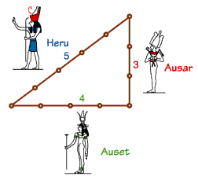

#Problem A: Egypt

A long time ago, the Egyptians figured out that a triangle with sides of length 3, 4, and 5 had a right angle as its largest angle. You must determine if other triangles have a similar property.

##The Input

Input represents several test cases, followed by a line containing 0 0 0. Each test case has three positive integers, less than 30,000, denoting the lengths of the sides of a triangle.

##The Output

For each test case, a line containing "right" if the triangle is a right triangle, and a line containing "wrong" if the triangle is not a right triangle.

##Sample Input

	6 8 10
	25 52 60
	5 12 13
	0 0 0

##Output for Sample Input

	right
	wrong
	right