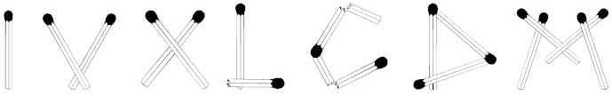
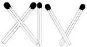

Problem A: Roman Numerals
=========================

**W**e would like to build Roman numerals with matches. As you know, Roman numerals are based on the following seven characters: I, V, X, L, C, D, M. Here we introduce the LUSIVERS font, in which the respective characters look like this:

Write a program that counts the number of matches used to build Roman numerals in the LUSIVERS font. This number is exactly the total number of "match heads" in the characters. For instance, to make the number 14 (=XIV), five matches are used.

You must follow the "standard modern Roman numerals" (as shown on the Wikipedia page). Expressions like IC or IIII are not allowed.

Input
-----

Input contains multiple lines, each giving a value of N (1 ≤ N ≤ 3999).

Output
------

For each test case, output the number of matches required to build the number N in Roman numerals.

Sample Input
------------

	14
	2011

Sample Output
-------------

	5
	11
	
---
*Problemsetter: Mak Yan Kei*  
*The LUSIVERS font is available on FontSpace as a freeware*