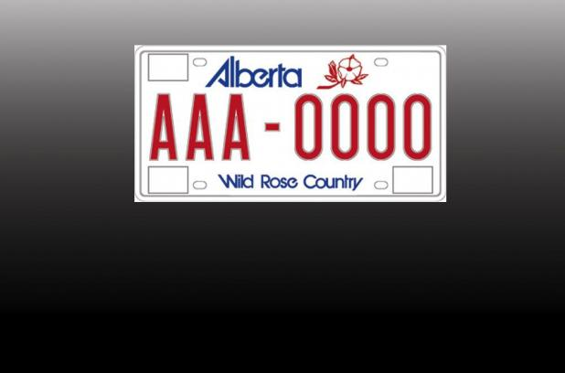

Problem A: Nice Licence Plates
==============================



Alberta licence plates currently have a format of ABC-0123 (three letters followed by four digits).

We say that the licence plate is "nice" if the absolute difference between the value of the first part and the value of the second part is at most 100.

The value of the first part is calculated as the value of base-26 number (where digits are in [A..Z]). For instance, if the first part is "ABC", its value is 28 (0\*26^2 + 1\*26^1 + 2*26^0). So, the plate "ABC-0123" is nice, because |28-123|<=100.

Given the list of licence plate numbers, your program should determine if the plate is nice or not.

Input Format
------------

First line of the input contains an integer N (1<=N<=100), the number of licence plate numbers. Then follow N lines, each containing a licence plate in the format LLL-DDDD.

Output Format
-------------

For each licence plate print on a line "nice" or "not nice" (without quotes) depending on the plate number being nice as described in the probem statement.

Sample Input
------------
```
2
ABC-0123
AAA-9999
```

Sample Output
-------------
```
nice
not nice
```

---
*Darko Aleksic*  
ACPC 2012